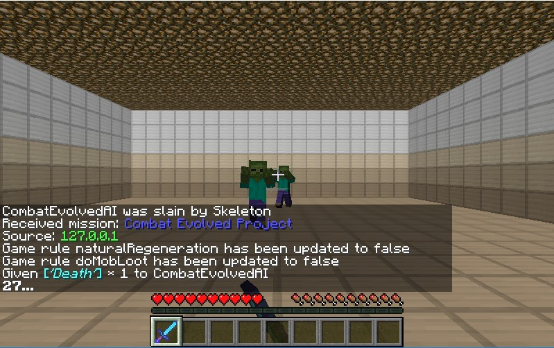
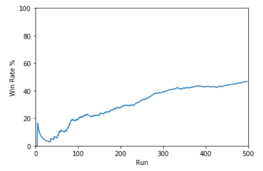
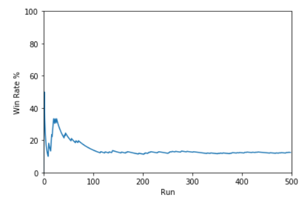
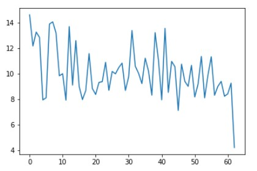
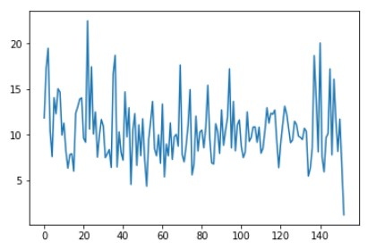
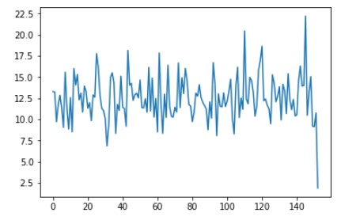
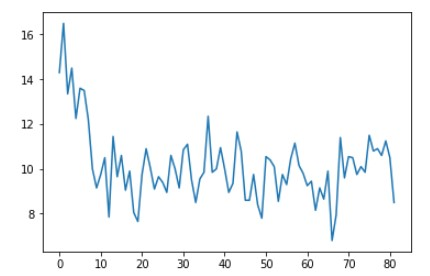

---
layout: default
title: Final Report
--- 

## Video
<iframe width="560" height="315" src="https://www.youtube.com/embed/OEBWlOP7Ot0" frameborder="0" allow="accelerometer; autoplay; encrypted-media; gyroscope; picture-in-picture" allowfullscreen></iframe>

## Project Summary
Our project aims to train an AI agent to make decisions and triumph in combat in complex situations and with different weapons.  We define complex situations to be states where the agent is fighting against multiple and different monsters. Each monster will have different parameters: health, speed, damage. Our agent currently fights against Zombies and Skeletons as other enemies have other mechanics that we were unable to account for (height and explosions). 

We use Deep Q-learning and Reinforcement learning to teach the AI how to make decisions on which enemies to fight first. Our agent is thrown into an enclosed room to fight against a group of enemies. It starts with just one enemy and the environment will sequentially update to add more enemies. The CNN takes in three images provided by Malmo before compiling the best action. This action will then produce a new state and that will produce a reward for the action. As the number of enemies increase, our agent is forced into a situation where it must adapt and choose whether to approach the enemy or run away. The agent will try to get the maximize the rewards by killing all enemies while avoiding attacks. This situation becomes more complex and harder for our agent to adjust to fighting multiple enemies as each additional enemy will deal more damage to the agent.

## Approach
#### Malmo Environment
We needed an environment to train and test our agent to fight against skeletons and zombies.  We choose to create a closed flat room to simplify the problem and remove the issues of the AI needing to jump and to remove the possibility of cover from the naturally generated terrain

Some more details of our environments.
 - used the DrawCuboid function to generate the room
 - Covered the ceiling with glow stone to provide light for the AI to see.
 - Randomly generated either Zombie or Skeleton for the AI to fight
 - Mobs were placed randomly within the room
 - Tested different enchantments on weapon
 	- Regular Diamond Sword
 	- Diamond Sword with Sharpness V
 	- 1HKO Sword

#### States
Our states are 3 images (3 frames per tick) and processed by cv2 into a 84x84 grayscale image before being processed by the CNN.

#### Actions
For our actions, we used continuous movement. We allow the AI to attack, move both forwards and backwards and to turn in both directions. Overall the AI had the following actions:
 - Move Forward
 - Move Backward
 - Turn Left
 - Turn Right
 - Stop Moving
 - Attack

#### Rewards
 - Taking Damage: -5 points per life lost
 - Death: -20 points
 - Landing a hit: +30 points
 - Having an enemy in the line of sight: +1 points
 - Having an enemy not in the line of sight: -0.1 points

#### Algorithms and Equations
We decided to use Deep Q Network to train our agent with providing 3 frames/images of the state as inputs to our convolutional neural network. The basic idea of Deep Q Network is similar to that of the Q-Learning where we have a reward (Q-Value) associated with a state and each of its corresponding action(s). Then we select the action which possesses the maximum Q-Value among all options. Our previous q-learning algorithm in our first baseline status report was adequate for training with 5 actions and a single enemy but with an increase in the number of actions to 6 and an increase in the density of mobs as well as the type of mobs, the number of states increases in complexity significantly and thus, we decided to use Deep Q Network, in which the Q-Function is represented by a Neural Network that takes a fixed input of images and outputs an action for the AI to perform based on q values.

To balance between exploration and exploitation, we introduce an epsilon (-greedy) value which decays at a constant rate to switch between random actions and q value based actions.

## Evaluation 
#### Quantatitve
We tested our agent using different weapons to see how it would perform in those situations. 

Our first tests were with a regular Diamond Sword (evaluated with win-rate)
- 1v1 (trained with 500 runs)
	- Agent had an overall 46.4% win rate
	- 1st Half: 32.8% win rate
	- 2nd Half: 60% win rate
	- About 2x as much wins during 2nd half

Agent performed a lot better within the second half of the training which is greatly improved over Q-Table implementation which only had a win-rate of 31%

- 2v1 (trained with 500 runs)
	- Agent only had an overall win rate of 12.4%
	- 1st Half: 12% win rate
	- 2nd Half: 12.8% win rate
	- Barely any difference

Agent did not perform so well against 2 enemies as we had wanted and we did not test it against 3 enemies. This was most likely due to our inputs as we were unable to allow the agent to check its position in the room so it would get trapped in a corner. With this result, we decided not to move onto testing with a Diamond Sword with Sharpness V. The results were not that much different as we only tested with a 3v1 to see how well the agent would do. This  

Our last tests were done with the 1HKO sword to see how fast our agent would be able to kill the enemies
- 1v1 (90.86% win rate)
The agent spends less time after a while trying to kill the monster as shown below

- 2v1 (73.14% win rate)

- 3v1 (66.57% win rate))

The drop in win rate is acceptable as the complexity of the problem significantly increases as the number of monsters increase.

#### Qualatative
The main tactic I saw from the agent is that it would hug the wall and have the monsters clump up together and it would attack all of them as they chase him. There were times when it would switch tactics and go on the offensive. It would suddenly go towards the enemy and fight rather than run away, and this was done when it had a better weapon. The agent would be more aggressive rather than evasive when it had a stronger weapon, which would result in it dying faster or killing faster. This is mostly shown when the agent had the diamond sword with the sharpness enhancement. 

Overall, we consider that the project is a success with the results produced despite needing to rely on handicaps.

### Resources:
As we were updating the project to include Deep Reinforcement Learning, we referenced Fighting Zombies In Minecraft With Deep Reinforcmenet Learning () heavily as it provided a great basis for us to learn from. From then on we used TensorFlow's tutorials and documentation to try and figure out the rest of the network.

- [Fighting Zombies In Minecraft With Deep Reinforcement Learning](http://cs229.stanford.edu/proj2016/report/UdagawaLeeNarasimhan-FightingZombiesInMinecraftWithDeepReinforcementLearning-report.pdf)
- [Gladiator](https://keiki83.github.io/Gladiator/)
- [Survival of the Fittest](https://mingh2.github.io/SurvivalOfTheFittest/)
- [Hit-Test Python Example](https://github.com/microsoft/malmo/blob/master/Malmo/samples/Python_examples/hit_test.py)
- [TensorFlow](https://www.tensorflow.org/tutorials/)
- [Minecraft Sword Enhancement](https://www.digminecraft.com/lists/sword_enchantment_list_pc.php)
- [Minecraft 1HKO Sword](https://minecraftcommand.science/commands/22591)