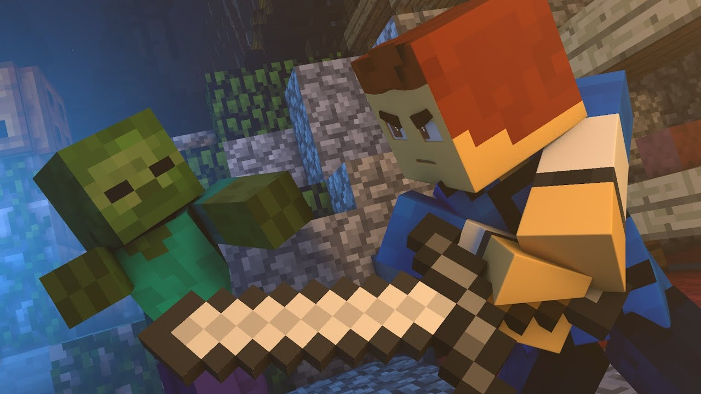

Source code: https://github.com/MirageVortex/CombatEvolved

Reports:

- [Proposal](proposal.html)
- [Status](status.html)
- [Final](final.html)

## Our Mission:
Create an AI that can learn to fight against multiple enemies and use it other games and see if it can adapt to the evironments there.

## Useful Links:
- [Fighting Zombies In Minecraft With Deep Reinforcement Learning](http://cs229.stanford.edu/proj2016/report/UdagawaLeeNarasimhan-FightingZombiesInMinecraftWithDeepReinforcementLearning-report.pdf)
- [Q-learning](https://en.wikipedia.org/wiki/Q-learning)

## Other Projects that inspired us:
- [Gladiator](https://keiki83.github.io/Gladiator/)
- [Survival of the Fittest](https://mingh2.github.io/SurvivalOfTheFittest/)

- [Malmo Combat AI](https://www.youtube.com/watch?v=VaNi34cn9uE&t=21s)