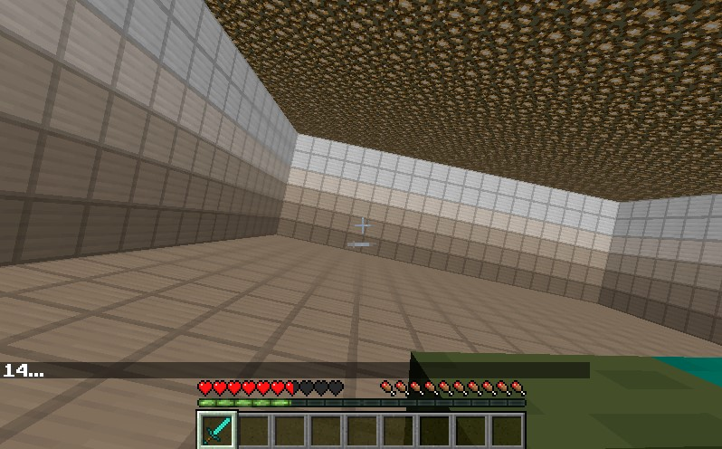
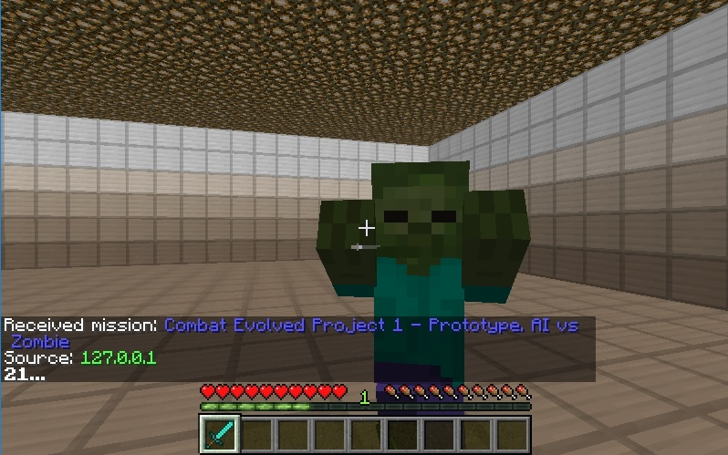

### Project Summary: 
We plan to use Deep Q-learning, and Reinforcement learning to allow the AI to make decisions on which enemy to fight first, and the best order in which to fight different types of enemies.  The Algorithms will consider the positions of the player and of the monsters to decide on its actions.

We have categorized the environment into discrete states based on each monster’s relative distance to the player and whether the monsters are currently in the player’s point of view.  And we have isolated the player’s actions into 6 actions: move forward, move backward, turn left, turn right, stop moving and attack.  The algorithm rewards the player for defeating the mob, and punishes it for each swing it performs, incentivizing the player to kill the monster in as few swings as possible.  The algorithm also slightly rewards the player for damaging the monster.

### Approach:
We approached the problem by first implementing the Q-learning, a reinforcment learning technique we learned in the second assignment by updating a Q-table after every interation of the program. We set up a 10x10 room and placed both our AI and our enemy at 2 spots across from each other in the room. The AI is given different states with the amount of enemies in the room, their distance to the player, and if there is an enemy directly in front of the AI. We had set up 5 different actions that the AI can perform: move forward, move backward, turn left, turn right, stop moving, and with attack on at all times. We decided to reward the AI for landing an attack (+50pts) and for killing an enemy (+100pts). In addition, the AI will have points detracted for spamming attack with each attack action having -5pts while dying to the enemy has -100pts. This was the reinforcement learning approach that we've applied to the AI so that it can learn to combat a single zombie within an enclosed space.

We obtained very specific information from Malmo about the world state to decide what entities were needed to be included into the states. We used the world state function to obtain the positions of all relative entities in the encapulsated area (Monsters and our AI), how much life they had after each update, and if there was a monster entity in front of it. Our AI would consider the distance it was away from the enemy and use this to plan out what action would provide it with the best total score. We packaged the states in a readable format and passed it to our action processing functions. Our AI then would fight against a zombie within 25 seconds as we saw that this was the shortest amount of time needed for our AI to die or kill the zombie.

### Evaluation: 
We allowed our program to run for a total of 100 times to see how long it would take to efficiently fight against a single zombie. We are using several metrics such as win-rate and how long it takes for the AI to kill the enemy. Although this evaluation is very limited in how much data it is pulling from, we feel that it produced enough results for us to consider its problems and to see what we need to improve upon before the final report. Among the results, we noticed several things that the AI did that we were satisfied with for this iteration and one that we did not expect.

We watched our program do random actions over several iterations and as it continued to learn. It would do several things such as wait for a hit to recharge and turn more when it discovered the enemy so that as it moved towards it. The AI would swing slightly less when the zombie was not in front of it. It would suddenly pause after some actions to turn left and right as if looking for the zombie. Another action that we noticed was that the AI would wait for the attack meter to recharge before attacking the zombie right away. This was one aspect we did not expect the AI to do consistently and with this, we were content with where our status was in the project. This would help us change our reward system as we want the AI to kill the enemy faster rather than land as many attacks as possible.

Our program has a 31 percent win rate against the zombie. Although this percentage is really low, we concluded that it was a successful iteration our AI had won 18 out 31 times in the latter half of the tests. There was about a 20% increase in wins in the later half, and if we ran the program any longer, we expect to have about a 50% win rate after about 500 increments of the program running. However, with the results that we saw, we realized that there were several other features that we did not incorporate into our states and rewards for our algorithm that would greatly improve our win rate. There are still other parameters that we have not tested yet with our program, but plan on using to evaluate our program in the final report. Towards the end of the tests, our AI was killing enemies at an average of 13 seconds while the earlier increments took about 20 seconds.

### Remaining Goals and Challenges: 
Our goal for the next few weeks is to implement the Deep Q-learning aspect by implementing the neural network and to add more information for the AI to consider. We realized after this status that there are to little information in each state and there are some other pieces of information needed to increase the rate of victory against the single enemy. One specific feature that we plan on implementing is to allow the AI to consider where the enemy is relative to its view. After completing those implementations, we plan on increasing the amount of enemies and add a variety of enemies for our AI to fight against. With each addition, we will look back at our program and make adjustments as needed. We will have different human players attempt the challenge to get a baseline to see how fast humans can complete this change and how fast our AI can complete this challenge. 

We expect to run into issues with the incorporating the neural network into our program and some bugs like having the program not end properly for the next iteration to initialize, similar to the ones we experience in our status report. Our plan is to quickly fix the bugs we've experienced in the current iteration of our AI and to add some more constraints to it as well. We plan on reducing its fullness to prevent the AI from healing itself while fighting the monsters. If time permits, we also wish to add a shield to AI and add a block function to allow it to block enemy attacks, so that it can try to take less damage against the enemies it fights.

### Resources:
We drew heavy inspiration from the previous year's projects, Assignment 2 and external papers.  The previous year's projects that we used as reference was from group 20’s Gladiator and group 6’s Survival of the fittest. We also used the malmo python example code: hit_test.py to understand how the AI can visualize mobs.  We attribute most of our work on Q-tables from the experience we obtained from Assignment 2, and we designed our project concept based on the paper Fighting Zombies in Minecraft With Deep Reinforcement Learning by H. Udagawa, T. Narasimhan, S. Lee.

- [Gladiator](https://keiki83.github.io/Gladiator/)
- [Survival of the Fittest](https://mingh2.github.io/SurvivalOfTheFittest/)
- [Hit-Test Python Example](https://github.com/microsoft/malmo/blob/master/Malmo/samples/Python_examples/hit_test.py)
- [Fighting Zombies In Minecraft With Deep Reinforcement Learning](http://cs229.stanford.edu/proj2016/report/UdagawaLeeNarasimhan-FightingZombiesInMinecraftWithDeepReinforcementLearning-report.pdf)

### Video:

